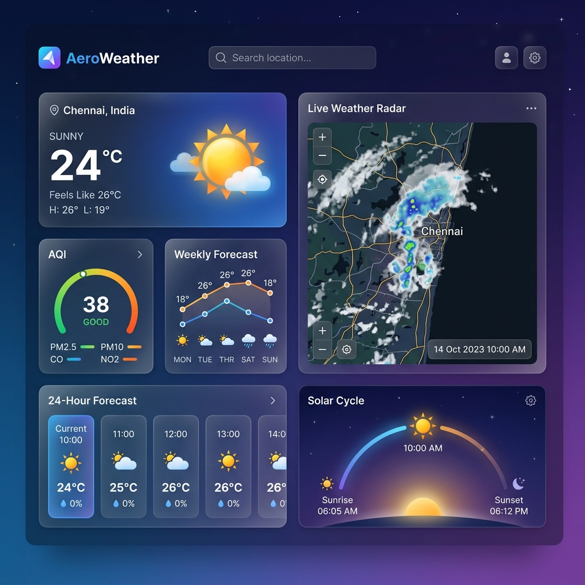
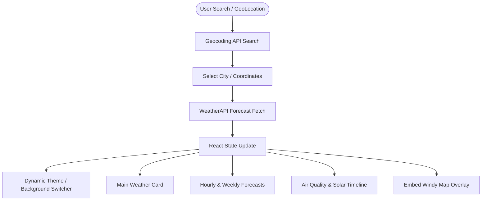

<div align="center">
  
  # 🌤️ AeroWeather
  
  **A premium, high-fidelity weather dashboard featuring dynamic themes and real-time radar mapping.**
  
  [](LICENSE)
  [](https://github.com/Mukilan-s18/weather-app/actions)
  [](https://vite.dev)
  [](https://react.dev)

  <br />
  
  [**Explore Live Demo »**](https://Mukilan-s18.github.io/weather-app/)
  
  <br />
  
  
</div>

---

## 📖 Table of Contents
- [Why AeroWeather?](#-why-aeroweather)
- [✨ Core Features](#-core-features)
- [🧩 Architecture & Data Flow](#-architecture--data-flow)
- [🛠️ Tech Stack](#️-tech-stack)
- [🚀 Getting Started](#-getting-started)
  - [Prerequisites](#prerequisites)
  - [Installation](#installation)
- [📦 Building & Production](#-building--production)
- [🔒 Security & Community Guidelines](#-security--community-guidelines)
- [🗺️ Future Roadmap](#️-future-roadmap)
- [📄 License](#-license)

---

## 🌟 Why AeroWeather?

AeroWeather isn't just another simple API project. It's an **enterprise-ready, high-fidelity single page dashboard** engineered to show off beautiful glassmorphism design patterns, clean separation of concerns, and smart integrations. 

The color scheme and background environment of the entire application adapt in real-time, synchronizing with the user's searched city weather (clear skies, snow, rainy, thunderstorm, or night).

---

## ✨ Core Features

*   **⚡ Real-Time Atmospheric Details**: Accurate, live metrics for temperature, apparent temperature ("Feels like"), humidity, wind speed, wind gusts, wind direction, UV index, and barometric pressure.
*   **🎨 Dynamic Adaptive Theming**: Seamless styling transitions between sunny, cloudy, rain, snow, thunderstorm, and night styles using a CSS custom variables architecture.
*   **📊 Hourly & Weekly Projections**: 
    *   *24-Hour Forecast*: Slideable timeline graph representing the upcoming hours with precise precipitation and temperature percentages.
    *   *7-Day Trend*: Beautifully styled card showing maximum/minimum margins per day.
*   **🛰️ Live Weather Radar Map**: Dynamic Leaflet & Windy iframe integration allowing users to toggle between rain, wind, temperature, cloud cover, and pressure overlays.
*   **🍃 Air Quality Monitoring**: Continuous updates on PM2.5, PM10 levels mapped against EPA guidelines.
*   **☀️ Solar Tracker**: Dynamic celestial curve illustrating current solar progression, sunrise, sunset, and twilight phases.
*   **📱 Responsive & Fluid**: Perfect, lag-free rendering on all desktop and mobile viewport structures with interactive hover animations.

---

## 🧩 Architecture & Data Flow

Below is the step-by-step workflow of the application, showing how user queries translate into dashboard updates:



---

## 🛠️ Tech Stack

AeroWeather leverages a clean, modern tech stack designed for speed and maintainability:

*   **Framework**: [React 19](https://react.dev/) (Functional components, custom Hooks)
*   **Build System**: [Vite 8](https://vite.dev/) (Ultrafast hot module replacement)
*   **Icons**: [Lucide React](https://lucide.dev/) (Vector icons library)
*   **Http Client**: [Axios](https://axios-http.com/) (For robust caching-ready fetches)
*   **Map System**: [Windy Embed API](https://api.windy.com/) (Interactive radar overlays)

---

## 🚀 Getting Started

Follow these instructions to run a copy of the project on your local machine for development and testing.

### Prerequisites
Make sure you have [Node.js](https://nodejs.org/) installed (v18 or higher recommended).

### Installation

1.  **Clone the Repository**:
    ```bash
    git clone https://github.com/Mukilan-s18/weather-app.git
    cd weather-app
    ```

2.  **Install Dependencies**:
    ```bash
    npm install
    ```

3.  **Run Development Server**:
    ```bash
    npm run dev
    ```

4.  **Open in Browser**:
    Navigate to `http://localhost:5173`.

---

## 📦 Building & Production

To compile and optimize assets for deployment:

```bash
npm run build
```

To preview the production bundle locally:

```bash
npm run preview
```

### GitHub Actions CI/CD Deployment
AeroWeather uses automated GitHub workflows:
*   `.github/workflows/ci.yml`: Performs a lint audit and build verify check on every incoming Pull Request.
*   `.github/workflows/deploy.yml`: Compiles and pushes output to the `gh-pages` server block on a push to `main`.

---

## 🔒 Security & Community Guidelines

We follow strict software engineering practices to ensure AeroWeather remains secure, welcoming, and open to contributions. Please review the following files:
*   [LICENSE](LICENSE) (MIT Open Source License)
*   [CONTRIBUTING.md](CONTRIBUTING.md) (Developer setups and code guidelines)
*   [CODE_OF_CONDUCT.md](CODE_OF_CONDUCT.md) (Community standards guidelines)
*   [SECURITY.md](SECURITY.md) (Security vulnerability reporting workflow)

---

## 🗺️ Future Roadmap

- [ ] **Multi-City Pinning**: Allow users to save their favorite cities to a persistent dashboard dock.
- [ ] **Desktop PWA Support**: Enable service workers for offline caching and desktop launcher install.
- [ ] **Push Weather Alerts**: Integrate Web Push API to alert users of storm warnings in pinned cities.

---

## 📄 License

Distributed under the MIT License. See [`LICENSE`](LICENSE) for more information.
