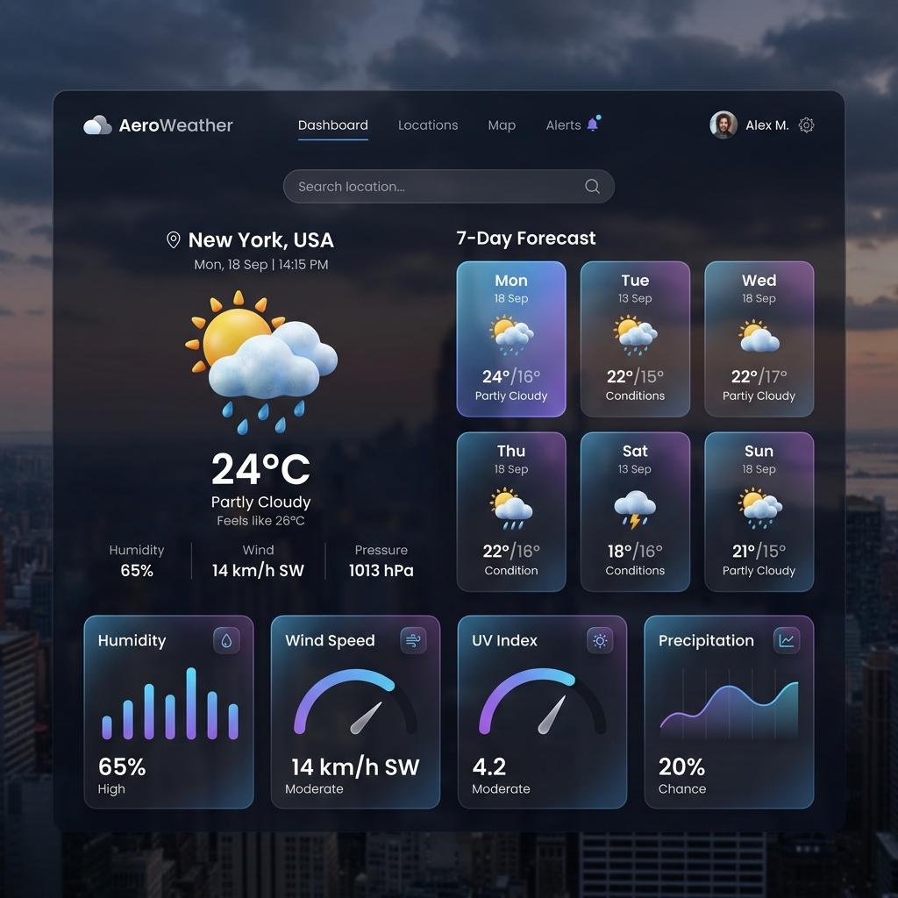
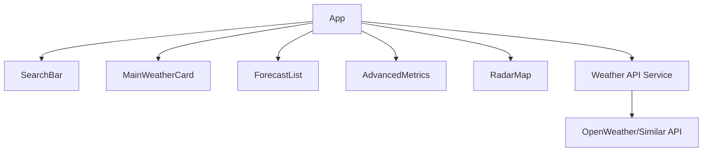

<div align="center">
  

  <h1>🌤️ AeroWeather</h1>

  <p>
    <strong>A stunning, high-performance weather dashboard built with React and Vite.</strong>
  </p>

  <p>
    <a href="https://github.com/mukilan/weather-app/actions/workflows/ci.yml">
      
    </a>
    <a href="https://github.com/mukilan/weather-app/actions/workflows/deploy.yml">
      
    </a>
    <a href="https://opensource.org/licenses/MIT">
      
    </a>
    <a href="https://github.com/mukilan/weather-app/issues">
      
    </a>
    <a href="https://github.com/mukilan/weather-app/stargazers">
      
    </a>
  </p>
  
  <p>
    <i>This project was developed as my final web development and mobile application project in the previous semester.</i>
  </p>
</div>

<hr>

## ✨ Features

- **Real-Time Data**: Get instantaneous, accurate weather updates for any global location.
- **7-Day Forecast**: Plan your week with comprehensive daily forecasts and temperature ranges.
- **Advanced Metrics**: View humidity, wind speed, pressure, UV index, and visibility in interactive cards.
- **Interactive Radar Map**: Visualize precipitation, cloud cover, and temperature gradients directly in the app.
- **Glassmorphic UI**: Enjoy a sleek, premium, modern dark-mode aesthetic with fluid micro-interactions.
- **Responsive Design**: Beautifully optimized for desktops, tablets, and mobile devices.

## 🚀 Live Demo

[Experience AeroWeather Live](#) <!-- Add your GitHub Pages URL here once deployed -->

## 🛠️ Architecture

AeroWeather follows a component-based architecture for optimal reusability and maintainability.


```mermaid
graph TD;
    App-->SearchBar;
    App-->MainWeatherCard;
    App-->ForecastList;
    App-->AdvancedMetrics;
    App-->RadarMap;
    App-->WeatherService[Weather API Service];
    WeatherService-->ExternalAPI[OpenWeather/Similar API];
```

## 💻 Tech Stack

- **Framework**: [React 18](https://react.dev/) + [Vite](https://vitejs.dev/)
- **Styling**: Vanilla CSS with modern Glassmorphism techniques
- **Icons**: [Lucide React](https://lucide.dev/)
- **Deployment**: GitHub Pages via GitHub Actions CI/CD

## 📥 Getting Started

Follow these steps to set up the project locally.

### Prerequisites

- Node.js (v18 or higher)
- npm or yarn package manager

### Installation

1. **Clone the repository:**
   ```bash
   git clone https://github.com/mukilan/weather-app.git
   cd weather-app
   ```

2. **Install dependencies:**
   ```bash
   npm install
   ```

3. **Set up Environment Variables:**
   Create a `.env` file in the root directory and add your weather API key:
   ```env
   VITE_WEATHER_API_KEY=your_api_key_here
   ```

4. **Start the development server:**
   ```bash
   npm run dev
   ```

## 🤝 Contributing

We welcome contributions! Please see our [Contributing Guidelines](CONTRIBUTING.md) and [Code of Conduct](CODE_OF_CONDUCT.md) for detailed information on how you can get involved, submit pull requests, and report issues.

## 🐛 Bug Reports & Feature Requests

Encountered an issue or have an idea for a new feature? 
Use our [Issue Tracker](https://github.com/mukilan/weather-app/issues) and fill out the respective templates.

## 🛡️ Security

If you discover a security vulnerability, please refer to our [Security Policy](SECURITY.md) for reporting instructions.

## 📄 License

This project is licensed under the [MIT License](LICENSE).

---
<div align="center">
  Crafted with ❤️ by <a href="https://github.com/mukilan">Mukilan</a>
</div>
